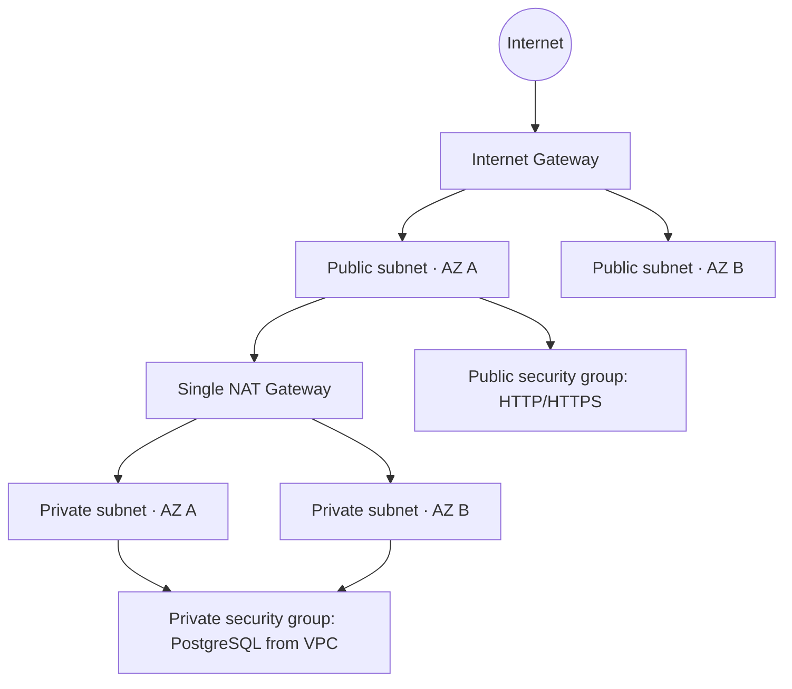

# Terraform AWS Multi-AZ VPC Foundation

[](https://developer.hashicorp.com/terraform)
[](https://registry.terraform.io/providers/hashicorp/aws/latest/docs)

A Terraform module for creating a practical AWS network foundation with public
and private subnets across multiple Availability Zones. It is designed as a
starting point for workloads such as ECS services, RDS databases, or
load-balanced applications.

Part of [Abel Nutsugah’s AWS infrastructure portfolio](https://github.com/bigmanabel).

## Use case

Use this repository when an application needs a clear network boundary:
internet-facing components in public subnets and application or data workloads
in private subnets. The module makes the subnet, routing, and security-group
relationships explicit and reusable.

## Architecture



## What Terraform creates

- VPC with DNS hostnames enabled
- One public and one private subnet per configured Availability Zone
- Internet Gateway and public route table
- One Elastic IP and a NAT Gateway for private-subnet outbound access
- Private route table associated with every private subnet
- Public security group allowing HTTP/HTTPS ingress
- Private security group allowing PostgreSQL ingress from the VPC CIDR

## Prerequisites

- Terraform `~> 1.7`
- AWS provider `~> 5.0`
- AWS CLI authentication through a profile, AWS IAM Identity Center, or
  environment credentials

## Configure and validate

Copy the safe example file, choose a CIDR range that does not overlap with
existing networks, and select available zones for the target region:

```bash
cp terraform.tfvars.example terraform.tfvars
terraform fmt -check -recursive
terraform init
terraform validate
terraform plan
```

```hcl
aws_region   = "us-east-1"
project_name = "example-vpc"
vpc_cidr     = "10.0.0.0/16"
azs          = ["us-east-1a", "us-east-1b"]
nat_gateway_per_az = false
```

Apply only after reviewing the plan:

```bash
terraform apply
```

The root module outputs the VPC ID and public/private subnet IDs for use by
application modules.

## Availability, security, and cost notes

- The subnets span the supplied Availability Zones, but the current design uses
  **one NAT Gateway and private route table per Availability Zone** by default.
  This avoids a single-AZ private-egress dependency.
- Set `nat_gateway_per_az = false` only for short-lived, cost-sensitive demos.
  That option routes all private subnets through a single NAT Gateway.
- This foundation deliberately creates no workload security groups. Define
  security groups next to the load balancer, compute, or database they protect
  so each ingress rule has a clear owner and least-privilege purpose.
- NAT Gateway, Elastic IP, and data processing can incur AWS charges. Review
  the plan and current AWS pricing before deploying.

## Project layout

```text
├── main.tf                    # Root module invocation
├── provider.tf                # Terraform and AWS provider requirements
├── terraform.tfvars.example   # Safe configuration template
└── modules/vpc/
    ├── main.tf                # Network, routing, NAT, and security groups
    ├── variables.tf           # Module inputs
    └── outputs.tf             # VPC and subnet identifiers
```

## Production follow-ups

Before using this foundation for a long-lived client environment, consider a
remote encrypted Terraform backend, consistent resource tags, VPC Flow Logs,
per-AZ NAT routing, least-privilege security-group rules, and a review of IPv6
or service-endpoint requirements.

## Cleanup

Run `terraform destroy` only after confirming the target account and workspace.
This removes the VPC and all resources created by this configuration.
